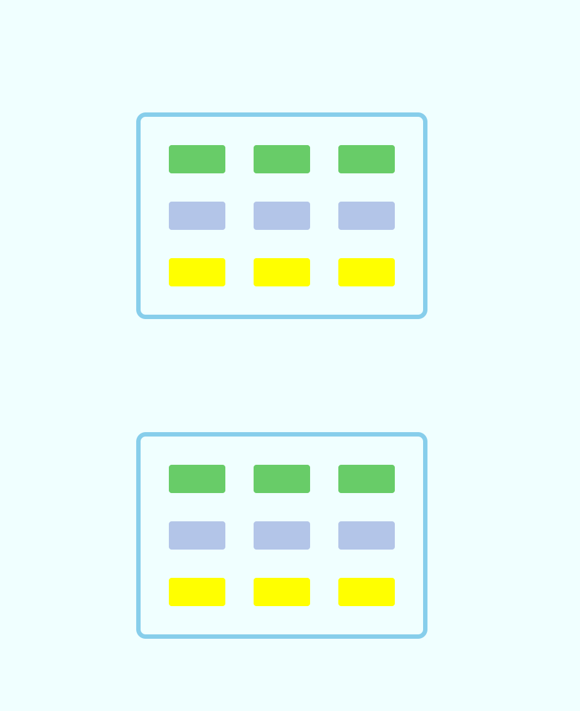

# T3.开辟找到微光娘的道路-CSS

> ```
> 难度系数：果然是easy
> ```
>
>单纯用 HTML 做出来的页面不太美观吧，那不妨试试加上 CSS 的协助，学完 CSS 后，相信你也能做出一个个好看的页面。

## **故事背景**

你终于发现了微光娘的位置-三教401？去一探究竟吧！

（到达第三教学楼楼下你发现……）三教楼下怎么这么多共享单车乱放，得把他们摆好才行（也许是你的道德感使然）

## **任务**

1. 制作代表共享单车的小方块，黄蓝绿三种颜色，每个方块的大小为宽60px，高30px——20
2. 将方块按图1样式排列，每个方块相距30px——30
3. 划分停放区域，即整体边框距离外围方块30px——30
4. copy上述内容，且让两个区域在不同尺寸的页面下呈现不同的相对位置，如下——20


<hr/>



## **攻略**

- 掌握基本的 CSS 知识 （ 至少你需要知道什么是盒子模型 、基础布局方式有哪些 ? 怎么居中 ？ 怎么控制元素的位置 ？）
- [CSS 教程 | 菜鸟教程](https://www.runoob.com/css/css-tutorial.html)
- [CSS: Cascading Style Sheets | MDN ](https://developer.mozilla.org/en-US/docs/Web/CSS)
- 什么是媒体查询？
- [阮一峰的网络日志----只要一行代码，实现五种 CSS 经典布局](https://www.ruanyifeng.com/blog/2020/08/five-css-layouts-in-one-line.html)

## **本题提交方式**

> [ 提交点这里 ](https://www.runoob.com/html/html-tutorial.html)
>
> 主题示例：2024090101012-张三-前端-03
>
> 提交文件：你的代码文件，总算交代码了！

## **出题者Q&A方式**

> QQ：3062803169