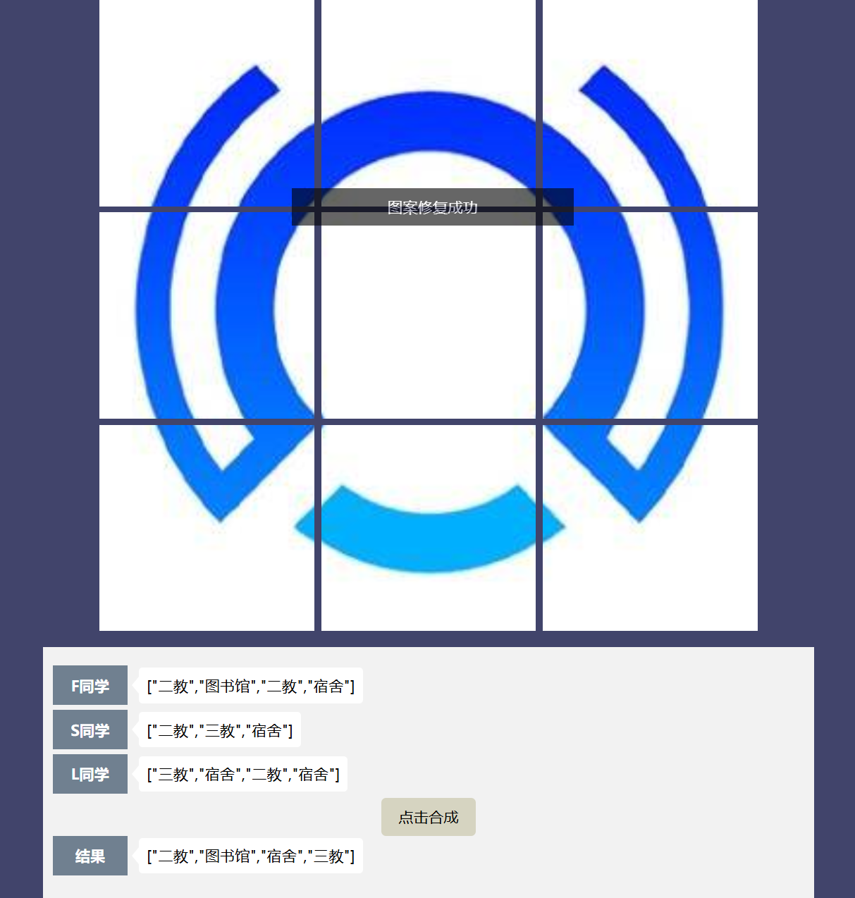

# T4-通往微光娘的最后一扇门——JavaScript

> ```
> 难度系数：不难吧
> ```
>
> 恭喜你一只脚踏入了前端的大门，这道题将会带领大家双脚进入前端的大门——学习JavaScript。
>
> 此题中，我们会使用JavaScript完成一些简单的操作，并在实现操作的过程中体会这门语言的特性和功能

## 故事背景

总算到了401门口，但这门怎么锁上了啊？（仔细观察门上的图案）看样子得解密了啊~

不过无妨，你和好友分头行动派出三人去寻找四散的图案碎片。

现在，这三人找到了不同的图案碎片，希望你通过这些碎片修复门口的图标。

## 任务

开始答题前，需要先下载本题的[项目代码文件夹](https://github.com/Fg0-MURAMASA/TEST-4)，目录结构如下：

```txt
├── js
│   └── collect-puzzle.js
├── css
│   └── style.css
├── images
└── index.html
```

其中：

- `index.html` 是主页面。
- `css/style.css` 是样式文件。
- `images` 是图片文件夹。
- `js/collect-puzzle.js` 是需要补充代码的 js 文件。

请在 `collect-puzzle.js` 文件中补全函数 **`collectPuzzle`** 中的代码，返回包含不同图案碎片的数组，最终拼出完整的门口图案，需要注意：

- 同一个人收集的图案碎片可能是有重复的。
- 同一组内不同的人收集的图案碎片也可能是有重复的。
- 工具函数需要统计所有人获取的**不同图案碎片**，而不是**图案碎片数量**。

例如:



统计所有人获取的不同的图案碎片并输出。如果四个地点的碎片全被搜集，就会显示图案修复成功（这个功能不用你实现，题目代码中已经有了）

## 提示

- 如何获取，整合各个碎片呢？了解一下JS中的数组操作(看看数组操作有哪些指令)
- 注意不要修改 `collect-puzzle.js` 文件外的任何内容。

- 下面是一些JS教程推荐
- [廖雪峰JS教程](https://www.liaoxuefeng.com/wiki/1022910821149312)
- [JS from MDN](https://developer.mozilla.org/en-US/docs/Web/JavaScript)
- [JavaScript语言入门教程](https://wangdoc.com/javascript/)
- [阮一峰es6入门](https://es6.ruanyifeng.com/)
- 善用 console.log() 函数，帮助你了解当前代码的运行情况

## **本题提交方式**

> [ 提交点这里 ](https://www.runoob.com/html/html-tutorial.html)
>
> 主题示例：2024090101012-张三-前端-04
>
> 提交文件：完善后的项目代码

## **出题者Q&A方式**

> QQ：1017327044
>
> 邮箱：[1017327044@qq.com](1017327044@qq.com)

