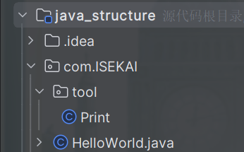

# Java02-程序基本结构-程序基本结构

在上一题中，我们成功搭建环境并运行了一段代码，在屏幕上打印出了“Hello World”，那么在本题中，你需要了解一个Java程序的基本结构。

## **Task1.单文件代码结构**

以下是一个名为“HelloWorld.java”文件中的代码：

```
package com.ISEKAI;
/*------------------------------------*/
import com.ISEKAI.tool.Print;
/*------------------------------------*/
public class HelloWorld {
        public static void main(String[] args){
            Test.test();
        }
}
/*------------------------------------*/
class Test{
    public static void test(){
        Print.print("Hello World");
    }
}
```

1. 可以看到，这份代码被分成了四个部分，请尝试解释每个部分，回答什么是包（pakage），包的作用是什么，什么是main函数，并总结出一个单文件java程序的基本结构
2. 在运行程序时，可以给程序传入参数，由main函数的args参数接收，请你更改main函数，使用命令行或者IDEA运行这个程序传入“111 222 333”这三个参数，并在main函数中打印出来。

## **Task2.多文件Java项目**

以下是一个简单的多文件Java项目。该项目的目录结构如图：



文字版目录结构：

```
Java_structure(根目录)
--.idea (存放IDEA的项目配置信息，由IDE自动生成，可忽略)
--com
  --ISEKAI
      HelloWorld.java
    --tool
      Print.java

即该项目只有两个文件“HelloWorld.java”和“Print.java”
```

2. 在你本地的IDEA中创建上述结构的java项目，HelloWorld.java文件的内容前面已经给出，现在请你写出Print.java文件中的代码，使得该Java项目能正常运行并打印出“Hello World”。


出题人QQ:2575824162