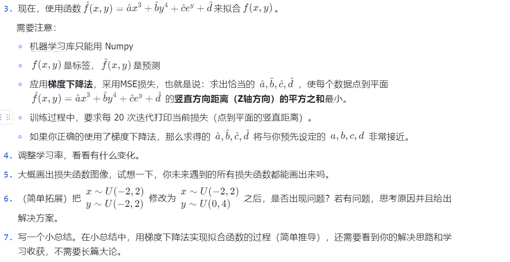

## 2.线性回归——梯度下降法的实践

```Plain Text
难度
```

> ：简单

在高中学习统计时，老师肯定提过用不同的函数去拟合散点图，现在，你将利用梯度下降的基础知识来实现这个过程！

### 无需提交部分

* 你之前了解过什么衡量平均误差的方法？均方误差是什么？
* 什么是**损失函数**？MSE 损失如何计算？并且去了解其他损失函数如**交叉熵损失**。
* **学习率**是什么？它在梯度下降中起到什么角色？
* Matplotlib 库你会使用吗？

### 需要提交部分

现有函数:

$$
f(x,y)=3x^3+y^4+e^y+5+\epsilon 

$$

$$
x ~  U(-2, 2)  y ~  U(-2, 2)  e ~  N(0,0.01) 
$$


其中：

x\~U(-2,2)表示随机变量 x 服从 -2 到 2 的均匀分布，epsilon为人为构造的噪声，

$$
\epsilon\sim N(0,0.01)
$$


表示随机变量,epsilon 服从均值为 0，方差为 0.01 的正态分布

1. 在x,y的分布区域内均匀取点(x,y)计算对应函数值
2. 使用Matplotlib库绘制出函数

$$
f(x,y)=3x^3+y^4+e^y+5
$$


**在第一小问中，你构造的散点图就是接下来需要拟合的数据**



### 注意事项

1. 源代码（必要的注释和良好的规范）
2. 每小问代码运行结果截图
3. Matplotlib 库绘制出的函数图像截图

### 提交方式

将题目中要求的提交的总结内容利用 Markdowm 格式进行编辑，并存为 PDF 文件。将其与你的源代码一起提交至邮箱：[gimmerml@163.com](mailto:gimmerml@163.com)

pdf文件名要求：姓名-学号-中档题02.pdf

### 出题人

皇家饼干（学长）

QQ: 3081962771