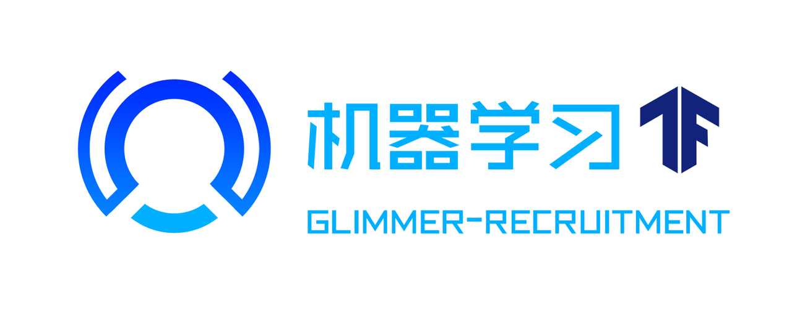

# 机器学习招新

欢迎选择微光的机器学习方向！

💡 **机器学习** 是人工智能的一个重要分支，是一类 “从数据中**自动分析**获得规律，并利用规律对**未知数据**进行**预测**的算法”。

😮 目前机器学习以及广泛运用于 📊**数据挖掘**， 👁🗨**计算机视觉**， 💬**自然语言处理**，👽 **生物特征识别**， 🔍 **搜索引擎**， 🏥**医学诊断**， 🎮**战略游戏** 和 🤖**机器人** 等领域。

😎机器学习考察分为一轮笔试和一轮面试，其中笔试持续一个多月（具体取决于大家的期中考试时间和完成情况），面试将在笔试之后进行。主要考察你们的学习能力，需要注意的是：**面试是考察的一个重要环节，内容围绕笔试开展**。

**👍笔试分为四个部分：入门，基础，拓展和进阶。提交完入门题之后，后面的题才会出现（回答质量有时候比进度更重要，也不用太在意别人的进度）。加油噢噢噢噢！**

😏我们在每个阶段中大致给出了你们需要掌握的知识点，请你们多做一些拓展📑，在面试的时候都有概率被考察。（所以请**科学借鉴**网上的信息👀）

我们希望在面试的时候，你能展现出一定的微积分、线性代数、python、机器学习和**英语**基础！

